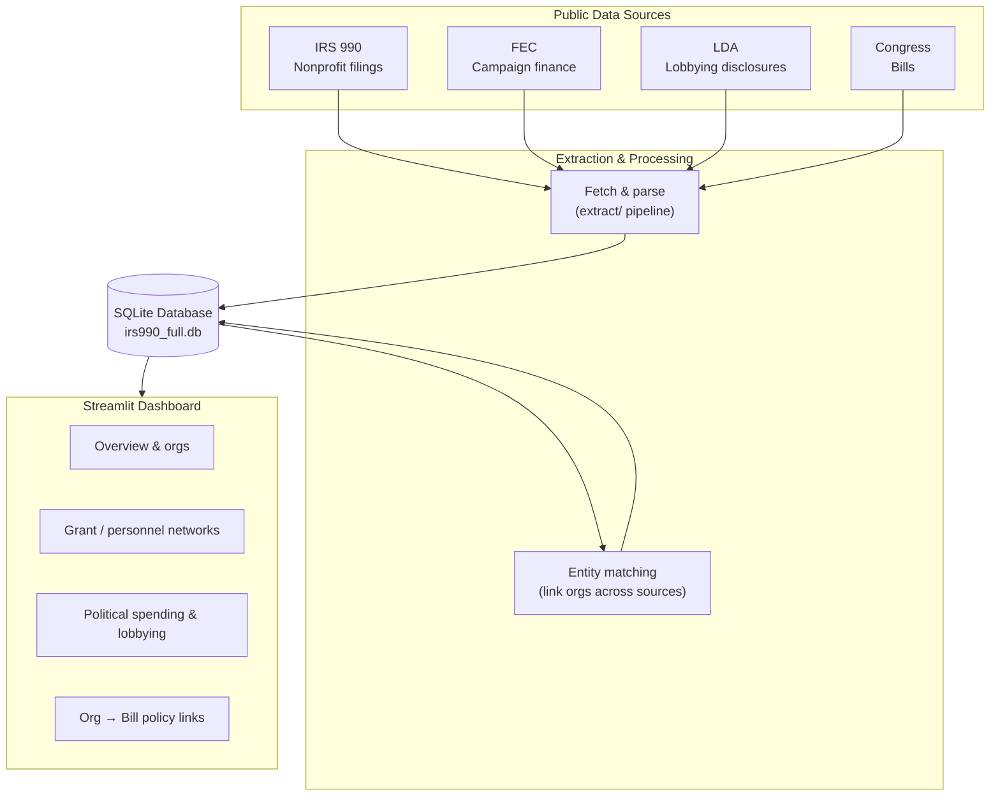

# influence-network
Capstone project investigating the role of the dark money network and its affect on US national policy.

We're pulling together IRS Form 990 filings, FEC campaign finance data, Senate
lobbying disclosures, and Congress.gov bill data to see if we can trace how
money and lobbying actually connect to policy outcomes. See
`influence_network.md` for the full project writeup (motivation, methodology,
data sources, prior work).

## Architecture

High level: pull four public data sources, parse and link them, store everything
in one SQLite database, and explore it through a Streamlit dashboard.



Run the dashboard with `streamlit run app/streamlit_app.py`.
## Setup

```bash
pip install -r requirements.txt
cp .env.example .env   # then fill in your API keys
```

Congress.gov and Senate LDA both work fine without a key at low volume; FEC
falls back to `DEMO_KEY` if you don't set one. See `.env.example` for details.

## Repo layout

- `extract/` - the actual ETL pipeline (collectors for Congress, FEC, LDA,
  and IRS 990 parsing), plus a SQLite schema in `db.py`. Runnable via
  `python -m extract.run <command>` - see the docstring at the top of
  `extract/run.py` for examples.
- `analysis/` - bill-text/lobbying-text alignment (TF-IDF or sentence
  embeddings) and other analysis helpers.
- `notebooks/` - exploratory and demo notebooks (quickstart, extraction
  smoke test, alignment demo, PDF similarity, etc.).
- `test_data_source_connections/` - early one-off notebooks used to poke at
  each API and see what the raw data actually looks like before we built the
  real extractors. See the README in there for more.
- `tests/fixtures/` - small hand-made sample files (e.g. a fake 990 XML) used
  to sanity-check the parsers without needing real bulk data.
- `data/` - gitignored; this is where extracted/downloaded data lands
  locally.


## IRS 990 storage and joins

The canonical IRS import tables are filing-scoped: `irs990_filings` and its
`irs990_filing_*` schedule tables. `organizations` holds the stable EIN-level
identity, while `irs990_source_objects` records the immutable IRS filename,
fingerprint, parser version, and import state. This preserves multiple returns
for one EIN and lets bulk imports resume without reparsing completed files.

`irs990_filings` stores the filer mailing address in `filer_address`,
`filer_city`, `filer_state`, and `filer_zip_code`. Address fields are populated
when the source XML is ingested; updating the parser does not backfill existing
rows that were already marked successful. Re-run ingestion for the source XML
with the current parser version when an existing database needs the address
fields refreshed. The filing-scoped `doing_business_as_name` field preserves
the optional DBA name separately from the legal `filer_name`.

The older `orgs` and `org_*` tables remain for compatibility with early
notebooks, but should not be used for multi-year IRS analysis. Use
`irs990_filings` as the starting point, then join schedule tables on
`filing_id`.

IRS, FEC, and LDA do not share a universal ID. `extract.entities` normalizes
names and persists exact normalized-name results as reviewable candidates in
`entity_match_candidates`; they are not automatic identity assertions. Accept
or reject candidates in `entity_match_decisions` before using them as joins.

## Project workflow

Use one SQLite file per research dataset. Load IRS, FEC, LDA, and Congress data
into that same file by passing `db_path=...` to each collector, then run
`extract.pipeline.refresh_analysis_layers`. The refresh creates reviewable
name-match candidates, extracts explicit lobbying bill references, and builds
views for grants, related organizations, approved external links, and
organization-to-bill facts.

`notebooks/01_build_dataset.ipynb` is the loading workflow and
`notebooks/02_review_and_explore.ipynb` is the review/analysis workflow. They
intentionally import reusable Python functions rather than carrying their own
ETL or matching logic. Cross-source names become analysis joins only after a
reviewer records an `accepted` decision.
