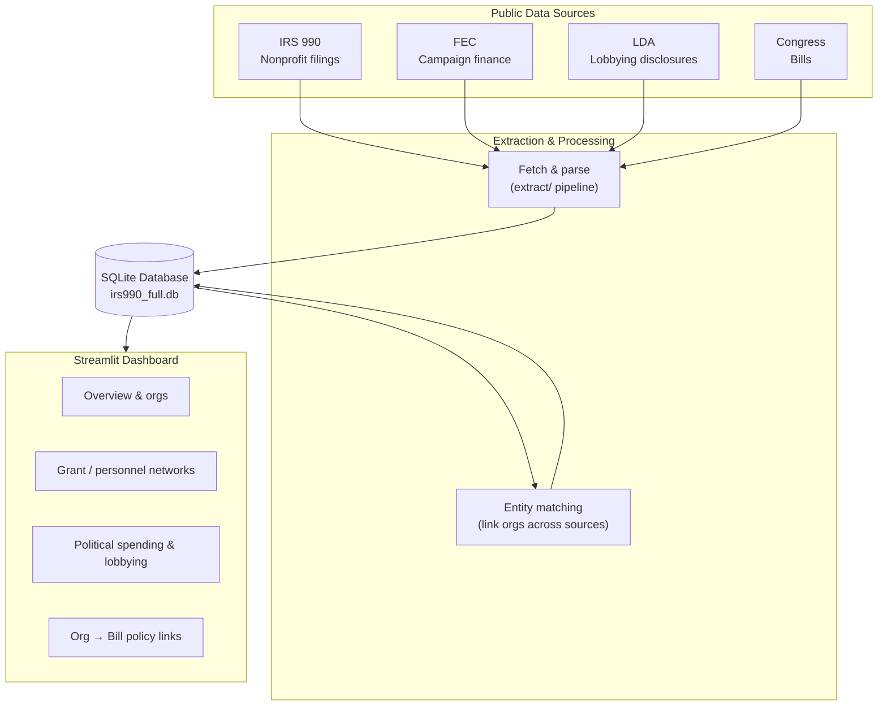

# influence-network
Capstone project investigating the role of the dark money network and its affect on US national policy.

We're pulling together IRS Form 990 filings, FEC campaign finance data, Senate
lobbying disclosures, and Congress.gov bill data to see if we can trace how
money and lobbying actually connect to policy outcomes. See
`influence_network.md` for the full project writeup (motivation, methodology,
data sources, prior work).

## Architecture

High level: pull four public data sources, parse and link them, store everything
in one SQLite database, and explore it through a Streamlit dashboard.



Run the dashboard with `streamlit run app/streamlit_app.py`.
## Setup

```bash
pip install -r requirements.txt
cp .env.example .env   # then fill in your API keys
```

Congress.gov and Senate LDA both work fine without a key at low volume; FEC
falls back to `DEMO_KEY` if you don't set one. See `.env.example` for details.

## Repo layout

- `extract/` - the actual ETL pipeline (collectors for Congress, FEC, LDA,
  and IRS 990 parsing), plus a SQLite schema in `db.py`. Runnable via
  `python -m extract.run <command>` - see the docstring at the top of
  `extract/run.py` for examples.
- `analysis/` - bill-text/lobbying-text alignment (TF-IDF or sentence
  embeddings) and other analysis helpers.
- `notebooks/` - exploratory and demo notebooks (quickstart, extraction
  smoke test, alignment demo, PDF similarity, etc.).
- `test_data_source_connections/` - early one-off notebooks used to poke at
  each API and see what the raw data actually looks like before we built the
  real extractors. See the README in there for more.
- `tests/fixtures/` - small hand-made sample files (e.g. a fake 990 XML) used
  to sanity-check the parsers without needing real bulk data.
- `data/` - gitignored; this is where extracted/downloaded data lands
  locally.


## IRS 990 storage and joins

The canonical IRS import tables are filing-scoped: `irs990_filings` and its
`irs990_filing_*` schedule tables. `organizations` holds the stable EIN-level
identity, while `irs990_source_objects` records the immutable IRS filename,
fingerprint, parser version, and import state. This preserves multiple returns
for one EIN and lets bulk imports resume without reparsing completed files.

`irs990_filings` stores the filer mailing address in `filer_address`,
`filer_city`, `filer_state`, and `filer_zip_code`. Address fields are populated
when the source XML is ingested; updating the parser does not backfill existing
rows that were already marked successful. Re-run ingestion for the source XML
with the current parser version when an existing database needs the address
fields refreshed. The filing-scoped `doing_business_as_name` field preserves
the optional DBA name separately from the legal `filer_name`.

The parser version is stored per source object. A parser-version change makes
the next `irs990` directory or ZIP ingestion reparse previously successful XML
files, so newly added fields such as `program_services_amt` and
`management_and_general_amt` are populated without changing the source files.

The older `orgs` and `org_*` tables remain for compatibility with early
notebooks, but should not be used for multi-year IRS analysis. Use
`irs990_filings` as the starting point, then join schedule tables on
`filing_id`.

IRS, FEC, and LDA do not share a universal ID. `extract.entities` normalizes
names and persists exact normalized-name results as reviewable candidates in
`entity_match_candidates`; they are not automatic identity assertions. Accept
or reject candidates in `entity_match_decisions` before using them as joins.

## Project workflow

Use one SQLite file per research dataset. Load IRS, FEC, LDA, and Congress data
into that same file by passing `db_path=...` to each collector, then run
`extract.pipeline.refresh_analysis_layers`. The refresh creates reviewable
name-match candidates, extracts explicit lobbying bill references, and builds
views for grants, related organizations, approved external links, and
organization-to-bill facts.

`notebooks/01_build_dataset.ipynb` is the loading workflow and
`notebooks/02_review_and_explore.ipynb` is the review/analysis workflow. They
intentionally import reusable Python functions rather than carrying their own
ETL or matching logic. Cross-source names become analysis joins only after a
reviewer records an `accepted` decision.

## Transparency index

The transparency pipeline produces a filing-year score for every non-990-T IRS
filing using the eight non-website components of the Irvin index
(`irvin-8-v1`). The board component uses the total governing-body count from
Form 990 Part I, line 4. Null values produced by a component calculation are
treated as zero, so every stored score has all eight components, an
`observed_components` value of 8, and `complete = 1`. The `website` source
field, `website_words`, and website observation metadata remain in the schema
for compatibility, but website collection is disabled and `website_words` is
always null. `normalized_index_score` is retained as a compatibility alias
for `index_score`; no partial-row normalization is performed.
The notebook documents the formulas and limitations.

Refresh the full transparency source snapshot and score table:

```bash
python -m extract.run transparency-index --db data/irs990_full.db \
  --export-parquet
```

The source snapshot and scores are written to SQLite, and `--export-parquet`
also writes the current Parquet representation and JSON manifest. The refresh
does not crawl websites; legacy crawl arguments are accepted for CLI
compatibility but have no effect. The score table is persisted in SQLite for
downstream modeling. Export a stored SQL run with:

```bash
python -m extract.run --db data/irs990_full.db \
  transparency-export-parquet --run-id RUN_ID
```

Import the current Parquet pair into the SQL tables with:

```bash
python -m extract.run --db data/irs990_full.db \
  transparency-import-parquet \
  --scores data/transparency_index/transparency_index__RUN_ID.parquet \
  --source data/transparency_index/transparency_source__RUN_ID.parquet
```

Refresh available IRS source objects after parser changes:

```bash
python -m extract.run --db data/irs990_full.db reingest-irs990 \
  --root . --path-prefix drive/ --eligible-only --force
```

`load_modeling_features()` defaults to complete rows for modeling. Since null
calculated components are stored as zero, the refreshed rows are complete and
coverage thresholds are no longer needed for the transparency score itself.

## End-to-end Transparency Index notebook

`notebooks/transparency_index.ipynb` is the canonical end-to-end workflow. It
documents the eight components and their limitations, checks the complete
population, explores score distributions, evaluates
a grouped disclosed-activity classifier, summarizes the organization network,
and reviews clustering and anomaly candidates. It keeps component missingness
separate from Schedule R relationship prevalence and explains how to use each
model output.

`notebooks/03_modeling.ipynb` is the bounded baseline feature-modeling workflow.
It generates filing, organization-history, related-transaction, and
people/compensation features for a reproducible, year-balanced 2023-2024 cohort,
then runs DBSCAN and Isolation Forest with sensitivity, overlap, OpenSecrets
label-retrieval, and review summaries. The 344 validated OpenSecrets EIN labels
are used only as a positive-only external check; they are not complete ground
truth and are not included in the model features. The notebook keeps the
transparency index as context rather than a model label and reports year-by-form
diagnostics so pooled results are not mistaken for year-specific behavior. The
full two-year population remains visible in the notebook, while the default
20,000-row cohort keeps the dense DBSCAN workflow practical and reproducible.
Set `COHORT_SIZE = None` in the notebook configuration to run all complete rows
on a machine with enough memory and time.

Run it from the repository root with:

```bash
python -m jupyter nbconvert --to notebook --execute \
  notebooks/transparency_index.ipynb --output /tmp/transparency_index_executed.ipynb
```

Run the baseline feature-modeling notebook with:

```bash
python -m jupyter nbconvert --to notebook --execute \
  notebooks/03_modeling.ipynb --output /tmp/03_modeling_executed.ipynb \
  --ExecutePreprocessor.timeout=1200
```
