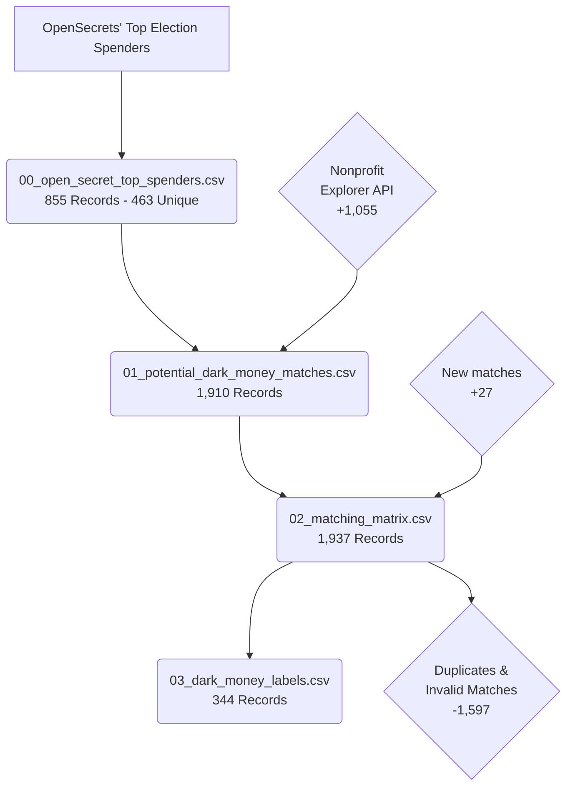

# Process Overview

1. [00_open_secret_top_spenders.csv](00_open_secret_top_spenders.csv) - The copied content from OpenSecret's [Top Election Spenders](https://www.opensecrets.org/dark-money/top-election-spenders) page dating back to 1990. "Ruling Date" column was dropped. Accessed on 2026-08-05.
2. [01_potential_dark_money_matches.csv](01_potential_dark_money_matches.csv) - The full set of potential matches, generated by passing the name of the organizations collected in the previous step through to the [ProPublica Nonprofit Explorer API's](https://projects.propublica.org/nonprofits/api) *Search Method*.
3. [02_matching_matrix.csv](02_matching_matrix.csv) - The full set of validation decisions made in Google Sheets after uploading the previous step into Google Drive. This sheet contains detailed information on which matches were validated and why. Notice that the number of records in this table is greater than the previously generated table. This is because additional records were generated whenever non of the potential matches were correct, and the correct match was inserted into the table.
4. [03_dark_money_labels.csv](03_dark_money_labels.csv) - This is the unique set of validated dark money organization labels. Because OpenSecret's data was historical, and because organization names can change over time, there were many duplicate validated matches. The organization names, as seen in our database, were stored in this table to make it more human-readable. However, the EIN's are really the only field required for processing.

---
